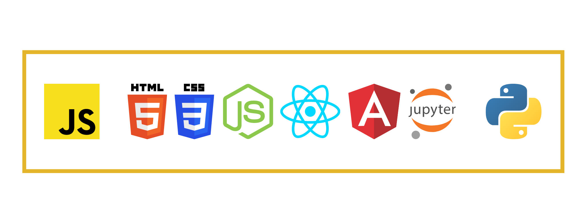

<h1>Hi visitor!, I'm Lucas.</h1>

<h3>Here a little about me:</h3>
<ul>
  <li> :round_pushpin: I from Brazil</li>
  <li> :computer: Javascript and Python programmer</li>
  <li> :wrench: Use the React and Angular Frameworks</li>
  <li> :hammer: Also work in back end with nodeJS</li>
  <li> :game_die: Also like to play with other languages, like C#, Java and others</li>
  <li> :musical_note: I really like rock'n roll </li>
</ul>

  
My posted projects

  
  [Tic Tac Toe](https://joselucasapp.github.io/Tic-tac-toe-game/) 
  [Currency prices against the BRL](https://brl-currency-converter.vercel.app/)

  
  
  
  

<!--
**JoseLucasapp/JoseLucasapp** is a ✨ _special_ ✨ repository because its `README.md` (this file) appears on your GitHub profile.

Here are some ideas to get you started:

- 🔭 I’m currently working on ...
- 🌱 I’m currently learning ...
- 👯 I’m looking to collaborate on ...
- 🤔 I’m looking for help with ...
- 💬 Ask me about ...
- 📫 How to reach me: ...
- 😄 Pronouns: ...
- ⚡ Fun fact: ...
-->
